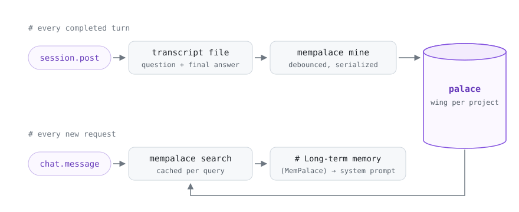

<div align="center">
  <picture>
    <source media="(prefers-color-scheme: dark)" srcset=".github/assets/banner-dark.svg">
    
  </picture>
</div>

<p align="center">
  <a href="https://github.com/mvalentsev/mimocode-mempalace/actions/workflows/ci.yml"></a>
  <a href="https://www.npmjs.com/package/mimocode-mempalace"></a>
  <a href="https://github.com/XiaomiMiMo/MiMo-Code"></a>
  <a href="https://github.com/MemPalace/mempalace"></a>
  
  <a href="LICENSE"></a>
</p>

<p align="center">
  <a href="#how-it-works">How it works</a> ·
  <a href="#setup">Setup</a> ·
  <a href="#options">Options</a> ·
  <a href="#import-your-past-sessions">Import history</a> ·
  <a href="#active-memory-mcp-and-the-knowledge-graph">MCP &amp; knowledge graph</a> ·
  <a href="#troubleshooting">Troubleshooting</a>
</p>

Long-term memory for [MiMoCode](https://github.com/XiaomiMiMo/MiMo-Code), backed by [MemPalace](https://github.com/MemPalace/mempalace).

MiMoCode ships a solid file-based project memory (MEMORY.md, checkpoints, FTS5 search). This plugin adds the other half: a semantic memory that spans all your sessions and projects. Every completed turn is saved into a MemPalace "palace", and on each new request the most relevant past exchanges are retrieved by meaning, not just keywords, and placed into the system prompt. The model doesn't have to remember to search; the plugin does it for it.

<p align="center">
  
</p>

The same round trip is pinned by [`test/e2e.test.ts`](test/e2e.test.ts) against a real palace: captured in one session, mined, and recalled through the system prompt in the next.

## How it works

<p align="center">
  <picture>
    <source media="(prefers-color-scheme: dark)" srcset=".github/assets/flow-dark.svg">
    
  </picture>
</p>

Write side:

1. `session.post` fires when a top-level turn finishes (it fires for completed and failed turns alike; only completed ones are saved).
2. The plugin writes the user question and the final answer as a small transcript file.
3. A debounced, serialized `mempalace mine` run files it into the palace. Runs never overlap, so the palace index stays healthy.
4. Exchanges are scoped into a wing named after your project directory, so search results stay project-relevant by default.

Read side:

1. `chat.message` remembers the text you typed.
2. `experimental.chat.system.transform` runs `mempalace search` with that text and appends a `# Long-term memory (MemPalace)` section to the system prompt: your identity file (optional) plus the top matching memories.
3. Results are cached per query for two minutes, so the multi-step tool loop of a single turn costs one search, not five.

Subagent slices (checkpoint writers, reviewers, title generators) are not captured, only the main loop. If mempalace is missing or the palace is unreachable, the plugin logs what happened and stays out of the way; your session works as if it were not installed.

## Requirements

- MiMoCode 0.1.5 or later
- MemPalace 3.3.5 or later — on anything older the plugin logs `plugin disabled` and neither reads nor writes

```bash
uv tool install "mempalace>=3.3.5"
```

## Setup

1. Create a palace (once):

```bash
mkdir -p ~/mimo-memory && mempalace init ~/mimo-memory --yes
```

`init` ends by offering to mine the directory right away — skip that: the folder is empty, and the plugin runs `mempalace mine` itself as you work.

2. Add the plugin and the MemPalace MCP server to `~/.config/mimocode/mimocode.json` (or a project's `.mimocode/mimocode.json`):

```json
{
  "plugin": [
    ["mimocode-mempalace", { "palace": "~/mimo-memory", "log": true }]
  ],
  "mcp": {
    "mempalace": {
      "type": "local",
      "command": ["/home/you/.local/bin/mempalace-mcp", "--palace", "/home/you/mimo-memory"],
      "enabled": true
    }
  }
}
```

Two keys, two halves. `plugin` is the memory loop itself — capture and recall into the system prompt. `mcp` hands the model MemPalace tools it can call on its own ([details](#active-memory-mcp-and-the-knowledge-graph)); the plugin works fine without it, so drop that block if you only want the passive loop.

Replace both `/home/you` paths with real absolute ones: `which mempalace-mcp` prints the first, the palace from step 1 is the second. The `command` array is spawned without a shell, so `~` is not expanded there (plugin options like `palace` do expand it).

MiMoCode installs the [npm package](https://www.npmjs.com/package/mimocode-mempalace) on the next start — there is nothing to `npm install` yourself. Options live right next to the plugin name, in the same file. No side-channel config files.

To hack on the plugin instead, a checkout works too — use the absolute repo path as the plugin name:

```json
{
  "plugin": [
    ["/home/you/src/mimocode-mempalace", { "palace": "~/mimo-memory" }]
  ]
}
```

3. Restart MiMoCode. The very first start can take a while as MiMoCode downloads and sets the plugin up; after that the plugin is ready within a few seconds of startup.

4. Check it took. Logging is on in the config above, so once your first turn completes:

```bash
tail ~/.local/share/mimocode-mempalace/plugin.log
```

`ready: MemPalace X.Y.Z, palace=..., wing=...` means the plugin is up; no log file at all means the plugin never ran — see [Troubleshooting](#troubleshooting). For the MCP half, ask the model to call `mempalace_mempalace_search`: until the first exchange is mined it answers `No palace found`, which is still the wiring working — it turns into real hits once a mined exchange exists. Have sessions from before the plugin? Switch on `backfill` now, it works best right after install (see [Import your past sessions](#import-your-past-sessions)).

## Options

| Option | Default | Meaning |
|---|---|---|
| `palace` | `~/.local/share/mimocode-mempalace/palace` | Palace directory (create it with `mempalace init`) |
| `bin` | `mempalace` | mempalace executable, if not on PATH |
| `wing` | `"auto"` | `"auto"` scopes memories per project directory name; a string pins one wing for everything; `false` drops per-project scoping — exchanges land in a shared `unsorted` wing and search is palace-wide |
| `searchScope` | `"wing"` | `"wing"` keeps recall inside the current project; `"palace"` searches across all projects ("how did I solve this in that other repo?") |
| `captureMode` | `"exchange"` | `"exchange"` saves question + final answer; `"turn"` also keeps the intermediate assistant replies of the turn (tool-loop reasoning) |
| `cleanupAfterMine` | `false` | Delete exchange transcripts once they are mined; by default they stay as a plain-text journal |
| `capture` | `true` | Save completed turns |
| `inject` | `true` | Retrieve and inject memories |
| `identityFile` | `~/.local/share/mimocode-mempalace/identity.md` | Markdown prepended to every injected block; missing file means no identity section; `false` disables. It is one global file injected in every project, so keep it about you, not about the project of the day |
| `injectResults` | `5` | Search results per injection |
| `injectMaxChars` | `6000` | Cap on the injected block size |
| `searchTimeoutMs` | `10000` | Search budget per query; on timeout the turn simply runs without memories |
| `mineDebounceMs` | `3000` | Quiet window before captured exchanges are mined in one batch |
| `mineTimeoutMs` | `120000` | Mine run budget |
| `mineAgent` | `"mimocode"` | Agent name mempalace records on every mined drawer |
| `backfill` | `false` | Import past MiMoCode sessions once: `true` for all, a number for the N most recent (see below) |
| `mimoDb` | `~/.local/share/mimocode/mimocode.db` | MiMoCode's SQLite database, read by `backfill` |
| `exportsDir` | `~/.local/share/mimocode-mempalace/exchanges` | Where exchange transcripts are kept |
| `agents` | `["main"]` | Agent slices to capture |
| `log` | `false` | `true` logs to `~/.local/share/mimocode-mempalace/plugin.log`, a string sets a custom path |

## Import your past sessions

Everything above only covers turns completed while the plugin is running. MiMoCode also keeps your whole history in a SQLite database, and the plugin can file it into the palace once:

```json
{
  "plugin": [
    ["mimocode-mempalace", { "palace": "~/mimo-memory", "backfill": 50 }]
  ]
}
```

On the next start the plugin reads the database (read-only; a live MiMoCode is fine, the db is in WAL mode), exports your past top-level sessions as transcripts — each scoped to the wing of the project it belonged to — and mines them. Subagent slices and hook-injected turns are filtered out, and sessions the plugin has already captured are skipped. `true` imports everything; a number imports the N most recent sessions.

Backfill runs once: it drops a `.backfill-done.json` marker next to the exchange transcripts and skips itself afterwards. Delete the marker to run it again. Best switched on right when you install the plugin.

## Active memory: MCP and the knowledge graph

The plugin covers the passive loop: capture and inject, no model discipline required. The `mcp` block you added in [Setup](#setup) step 2 wires in the active half: the MemPalace MCP server, tools the model calls on its own. Both halves share the same palace.

MiMoCode prefixes every tool with the server name from the config, so with the `mempalace` entry from Setup the model sees `mempalace_mempalace_search`, `mempalace_mempalace_kg_query`, `mempalace_mempalace_kg_add` and friends. The injected block answers most questions by itself; MCP lets the model follow up when the injected excerpt is not enough, and record durable facts into the knowledge graph.

To make the model actually use the graph, add a rules file (`AGENTS.md` in `~/.config/mimocode/` or your project):

```markdown
## Memory protocol

Relevant memories already arrive in the system prompt under "Long-term memory
(MemPalace)"; you don't need to search for what's already there.

- When an injected memory is truncated or you need more context around it,
  call `mempalace_mempalace_search` with a focused query.
- After a decision, a fixed bug, or a stated preference, record one fact with
  `mempalace_mempalace_kg_add` (subject "user" or the project name, object
  under 128 chars). Prefer quality over quantity; skip facts you are not
  sure about.
- Query `mempalace_mempalace_kg_query` for entity "user" when personalization
  matters.
```

## Notes

- Everything is local: exchanges, the palace, the search. Nothing leaves your machine beyond what your model provider already sees in the prompt.
- Exchange transcripts stay in `exportsDir` after mining. `mempalace mine` is incremental and skips already-filed files; the leftovers double as a plain-text journal of your sessions. Turn on `cleanupAfterMine` if you prefer them gone.
- A session that exits quickly can outrun the debounced mine. The next plugin start notices pending exchange files and mines them, so nothing is lost.
- The injected block tells the model to trust current code over old memories when they conflict.
- The plugin's palace is for conversations. If you also mine a whole codebase with the mempalace CLI, give that its own palace directory: tens of thousands of code drawers crowd conversation hits out of palace-wide searches, and CLI maintenance (`mempalace repair`) takes far longer on a big palace.
- Vanilla OpenCode isn't a target right now: the capture path is built on MiMoCode's `session.post` hook. For OpenCode, look at [opencode-mempalace-persistence](https://github.com/geco/opencode-mempalace-persistence).

## Troubleshooting

Set `"log": true` in the plugin options and read `~/.local/share/mimocode-mempalace/plugin.log`.

### The plugin

- `ready: MemPalace X.Y.Z, palace=..., wing=...` means the plugin found everything.
- The log file does not exist at all: the plugin never ran.
  - Check that MiMoCode is 0.1.5 or later, and give the very first start time to finish downloading the package.
  - Make sure the `plugin` entry sits in a config MiMoCode actually reads (`~/.config/mimocode/mimocode.json`, or `.mimocode/mimocode.json` of the project you launched it in).
  - A broken or empty `mimocode-mempalace@latest` folder under `~/.cache/mimocode/packages/` blocks the install from being retried — delete that folder and restart.
  - When in doubt, read MiMoCode's own log — the newest file in `~/.local/share/mimocode/log/`. `service=plugin` lines show the plugin being picked up (`loading plugin`) or the exact install error (`failed to install plugin`, usually the road to registry.npmjs.org). No `service=plugin` lines at all means MiMoCode never picked the plugin up from that config — run `env | grep -iE 'mimocode|xdg'` and look for `MIMOCODE_HOME` (relocates every path, config included) or `MIMOCODE_PURE` (turns off external plugins).
- `mempalace unavailable` means the binary isn't on the PATH MiMoCode runs with; set `bin` to an absolute path.
- `palace is empty until the first exchange is mined` is normal on a fresh palace; it goes away after your first completed turn. In the same state the MCP `mempalace_mempalace_search` answers `No palace found` with a hint to run `mempalace mine` yourself — don't: the plugin mines for you, and a bare CLI `mine` is how palaces get split (see [The palace and the CLI](#the-palace-and-the-cli)).
- `skip <session>: agent "..." not in [main]` shows the subagent filter doing its job.
- `search failed (code=143 timedOut=true)` under load: on a small machine a mine running in parallel can push a search past `searchTimeoutMs`; that turn just runs without memories. Raise `searchTimeoutMs` if it keeps happening.
- `backfill: exported N session(s) ...` reports the one-time history import; `backfill skipped: ...` names the reason (missing or unreadable database, unexpected schema).

### The MCP server

- No `mempalace_mempalace_*` tools in the session: the `mcp` block is missing from the config MiMoCode actually read, or was added without a restart — servers are picked up at startup. Also check that the first `command` entry is a real file (`which mempalace-mcp` prints it) and that both paths are absolute; `~` is not expanded inside `command`. The `service=mcp` lines in MiMoCode's own log tell the story: `found` means the config entry was read, `local mcp startup failed` means the `command` doesn't start.
- MiMoCode's log shows `MCP error -32601: Unknown method: resources/list` (and `prompts/list`) for `mempalace` right after `toolCount=35 create() successfully created client`: harmless noise. The server implements tools only, and MiMoCode probes the optional resources and prompts APIs anyway; the client is already connected by that point.
- MCP tools worked earlier in the session but now every call fails with `Not connected`: the server process died or was killed, and MiMoCode does not reconnect it within a running session. Restart MiMoCode.

### The palace and the CLI

- `Search error: Error executing plan: Internal error: Error finding id` means the palace directory references vector segment folders it does not contain. The palace is the whole directory, not just the database file: ChromaDB keeps vectors in `<uuid>/` folders next to `chroma.sqlite3`. This is what symlinking `chroma.sqlite3` into a second directory produces — and one search from the wrong root is enough to break search from the real one too (the plugin logs `palace warning: chroma.sqlite3 ... is a symlink` when it spots this). Keep one real palace directory, point every consumer at it, and run `mempalace repair --yes --palace <dir>` to rebuild the index.
- Maintaining the palace from the CLI: a bare `mempalace` command without `--palace` targets the default palace (from `~/.mempalace/config.json`, else `~/.mempalace/palace`) — not the plugin's. Mining or repairing there quietly splits your data across two palaces; always pass `--palace` matching the plugin's `palace` option.

## Development

```bash
bun install
bun test            # unit suite; the e2e file auto-skips without mempalace on PATH
bun run typecheck
```

See [CONTRIBUTING.md](CONTRIBUTING.md) for the ground rules and [CHANGELOG.md](CHANGELOG.md) for release history.

## License

MIT
